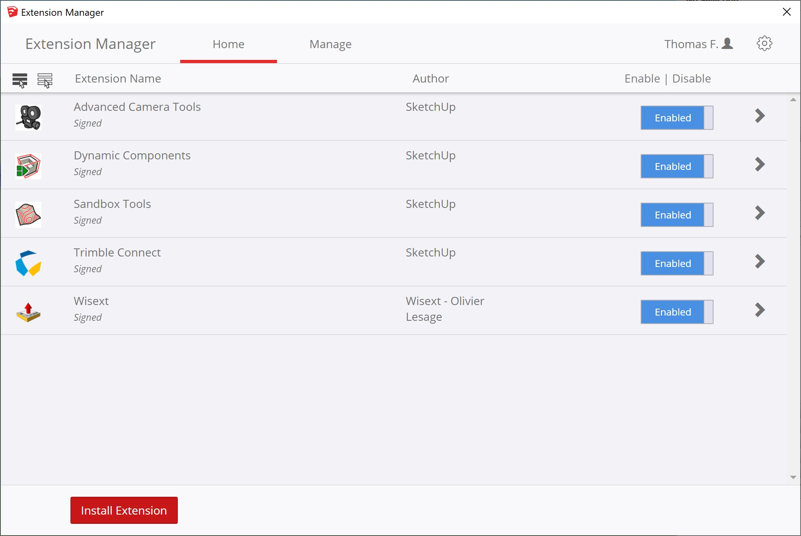
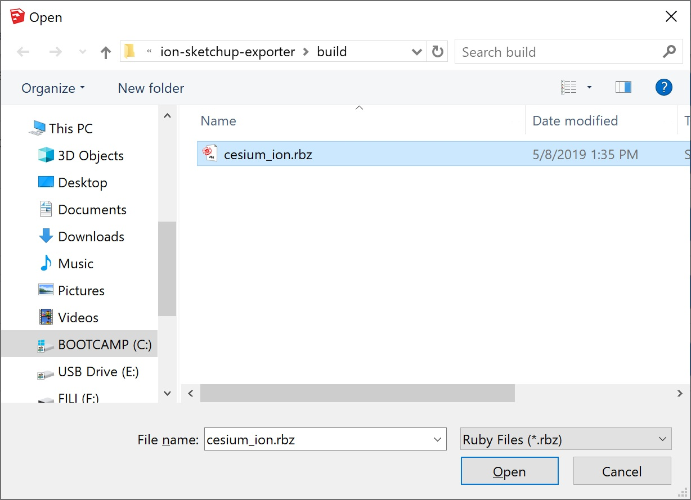
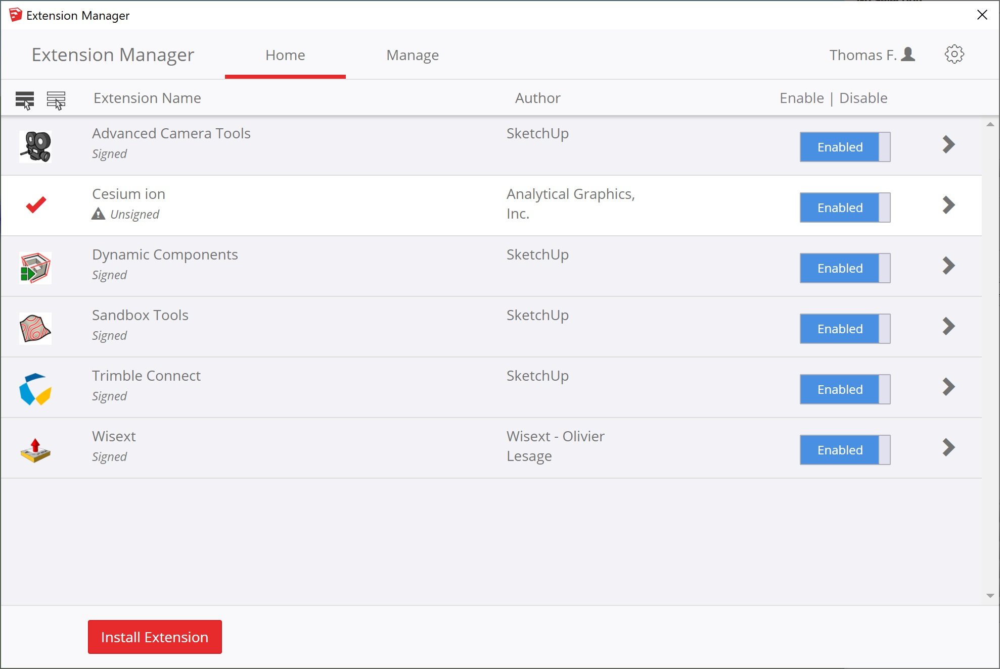
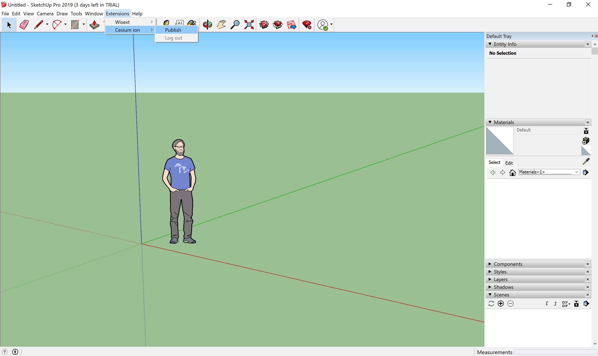

# Cesium ion Sketchup Extension
<p align="center">
<a href="https://cesium.com/"></a>
</p>

A SketchUp extension for publishing SketchUp models as 3D Tiles to your Cesium ion account for use in CesiumJS and other applications.

## Installation and Usage

See our official extension page https://extensions.sketchup.com/en/content/cesium-ion

## Local Development

### Sign up for a Cesium ion account

Go to https://cesium.com/ and create an account

### Install Ruby and required modules

Instructions can be found [here](https://www.ruby-lang.org/en/documentation/installation/).

#### Install bundler (it may already be installed)
```
gem install bundler
```

#### Install required modules
```
bundler install
```

## Building Plugin

Run the following command

```
ruby ./build.rb
```

The plugin file will be located at `./build/cesium_ion.rbz`.

## Locally installing in Sketchup

Under the `Windows` menu, select `Extension Manager`



Click `Install Extension`



Select the `build/cesium.rbz` file you built



Once it is installed, you can `Publish` from the `Extensions`->`Cesium ion`->`Publish` menu item



## Release

* Update the version in `cesium_ion.rb`
* Tag the version and push it
  * `git tag -a v1.x.x -m "Version 1.x.x"`
  * `git push origin v1.x.x`
* Go to the [Extension Warehouse](https://extensions.sketchup.com/en)
* Select `My Extensions` from the dropdown on the right side
* Click `Manage Store` on the left side
* Click `Edit` next to the `Cesium ion` Extension
* Change whatever you need to. Be sure to update the `.rbz` file and the `What's New` section
* Click `Save Draft`
* On the next page click `Publish`
